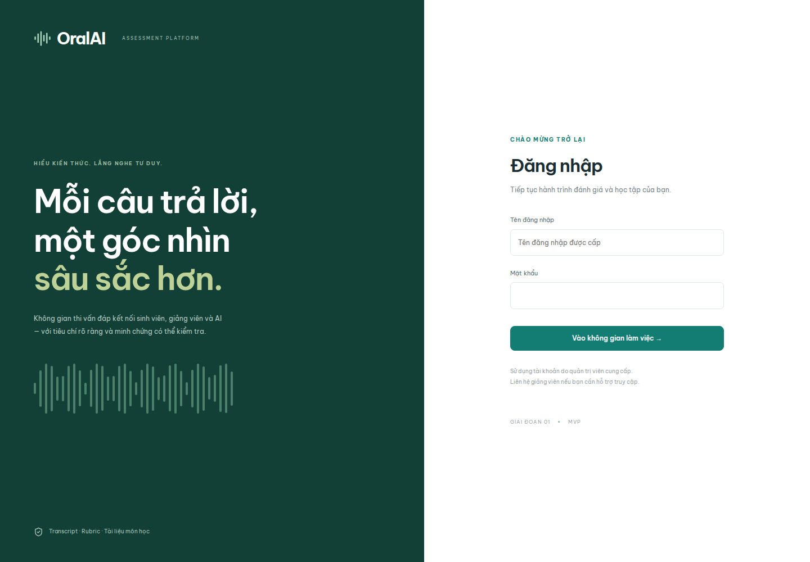

# AI Oral Assessment Platform — Giai đoạn 1

Nền tảng thi vấn đáp với **FastAPI + Next.js + Electron**, PostgreSQL/pgvector và MinIO. Sinh viên trả lời bằng giọng nói; server đánh giá từ **transcript + rubric + tài liệu RAG**. Audio/video chỉ là minh chứng để giảng viên xem lại.



- [Hướng triển khai và các quyết định giai đoạn 1](docs/architecture/phase-1.md)
- [Tài liệu yêu cầu gốc](AI_Oral_Assessment_PROJECT_GUIDE.md)
- [Biên bản kiểm thử](docs/validation.md)
- [CI thành công: Docker build, migration và E2E](https://github.com/NCKH-LongT/AI-Oral-Assessment-Platform/actions/runs/34502364619)

## 1. Chạy nhanh bằng Docker Compose

Cần Docker Engine/Docker Desktop **đang chạy**, Docker Compose và Python 3 để tạo cấu hình. Khuyến nghị máy phát triển có ít nhất 4 CPU, 8 GB RAM; Whisper cần tải model trong lần sử dụng đầu tiên.

Nếu dùng Docker Desktop trên Linux, khởi động daemon và chọn đúng context trước khi chạy Compose:

```bash
systemctl --user enable --now docker-desktop
docker context use desktop-linux
docker info
```

`docker info` phải hiển thị cả phần `Server`. Nếu máy cài Docker Engine thay vì Docker Desktop, dùng service `docker.service` và context `default` theo cấu hình của máy.

```bash
git clone https://github.com/NCKH-LongT/AI-Oral-Assessment-Platform.git
cd AI-Oral-Assessment-Platform
python3 scripts/setup_env.py
docker compose up -d --build --wait
```

Mở **http://localhost:3000**. Đăng nhập bằng `BOOTSTRAP_ADMIN` và `BOOTSTRAP_PASSWORD` trong `.env`. Script tạo mật khẩu ngẫu nhiên và không ghi đè `.env` đã tồn tại. Không commit file này.

Các dịch vụ:

| Dịch vụ | Vai trò / truy cập |
| --- | --- |
| web | Giao diện quản trị và phòng thi, `localhost:3000` |
| api | FastAPI, chỉ trong mạng Docker; web chuyển tiếp `/api/*` |
| worker | Xử lý tài liệu và chấm bài nền |
| migrate | Chạy Alembic và tạo admin ban đầu, kết thúc sau khi thành công |
| postgres | PostgreSQL 16 + pgvector, volume `postgres_data` |
| minio | Object storage; console `localhost:9001`, tài khoản từ `.env` |
| redis | Giới hạn số lần đăng nhập; volume `redis_data` |

```bash
docker compose ps
docker compose logs -f api worker web
docker compose restart api worker
docker compose down             # Giữ nguyên volume dữ liệu
```

`docker compose down -v` **xóa dữ liệu** trong các volume. Không dùng nếu cần giữ bài thi.

Swagger: http://localhost:3000/api/docs. OpenAPI JSON: http://localhost:3000/api/openapi.json. Đăng nhập trên web trước để dùng cookie cùng origin khi thử API.

### Dữ liệu mẫu tùy chọn

Mặc định hệ thống chỉ tạo admin. Để thử ngay một môn, tài liệu, rubric, bài thi 2 câu và hai tài khoản mẫu:

```bash
# Chọn mật khẩu riêng cho tài khoản demo (tối thiểu 12 ký tự).
read -rs -p 'Demo password: ' DEMO_PASSWORD
export DEMO_PASSWORD
docker compose exec -e DEMO_PASSWORD="$DEMO_PASSWORD" api python -m app.seed_demo
unset DEMO_PASSWORD
```

Tài khoản: `teacher.demo` và `student.demo`, dùng mật khẩu vừa nhập. Seeder chỉ chạy trong `AI_PROVIDER=demo`, không chạy tự động và không đặt lại mật khẩu của tài khoản đã có. Có thể dùng [tài liệu TXT mẫu](docs/examples/se101.txt) để tạo môn thủ công.

## 2. Hướng dẫn dùng web

### Quản trị viên / giảng viên

1. **Người dùng:** admin tạo tài khoản sinh viên hoặc giảng viên; mật khẩu tối thiểu 12 ký tự. Giảng viên có thể xem danh sách sinh viên để giao bài.
2. **Môn học & đề thi → Tạo môn học:** nhập mã, tên, mô tả. Giảng viên chỉ quản lý môn do mình tạo; admin quản lý mọi môn.
3. **01 · Kiến thức:** tạo Learning Outcome (LO), tạo chủ đề gắn với LO, rồi tải tài liệu theo chủ đề. Hỗ trợ PDF có text, PPTX, DOCX, TXT UTF-8; tối đa 20 MB/file. Chờ trạng thái **Sẵn sàng**. Có thể tìm thử ở mục kiểm tra RAG.
4. **02 · Rubric:** thêm các tiêu chí, mô tả, điểm tối đa và trọng số. Sửa rubric tạo version mới; các đề đã công bố giữ bản cũ.
5. **03 · Bài thi & giao bài:** chọn rubric, thời gian và blueprint (chủ đề, độ khó, số câu; tối đa 20 câu). Lưu bản nháp, bấm **Sinh câu hỏi & công bố**. Mỗi chủ đề cần tài liệu sẵn sàng. Sau đó chọn sinh viên và giao bài.
6. **Kết quả & xem lại:** mở từng bài để xem câu hỏi, transcript, điểm AI đề xuất theo tiêu chí, RAG evidence, audio và video. Bài có lỗi AI/độ tin cậy thấp giữ trạng thái **Cần xem lại**, chưa có điểm chính thức. Manual override/regrade dành cho giai đoạn 2.

### Sinh viên

1. Đăng nhập → **Bài thi của tôi** → mở bài được giao.
2. Cho phép camera và mic; kiểm tra preview và thanh tín hiệu khi nói. Bước này **chưa ghi**.
3. Bấm **Bắt đầu thi**. Server tính thời gian toàn bài.
4. Đọc câu hỏi → **Bắt đầu trả lời** → nói → **Kết thúc trả lời**. Chỉ khoảng thời gian này được ghi âm/ghi hình.
5. Chờ STT, kiểm tra transcript. Có thể thử STT lại hoặc ghi lại trước khi nộp. Transcript sửa tay được đánh dấu cần giảng viên kiểm tra.
6. **Nộp câu trả lời & tiếp tục**: transcript được lưu; audio/video tải nền theo chunk, không chặn câu tiếp theo. Nếu upload lỗi, bấm tải lại và giữ ứng dụng mở.
7. Trả lời đủ câu, chờ mọi minh chứng **Đã lưu**, bấm **Nộp bài thi**. Điểm chỉ hiện khi server xác nhận; bài demo luôn cần xem lại.

Dùng Chrome/Chromium hoặc Electron. Camera/mic cần **HTTPS hoặc localhost**. Không mở qua `http://IP-máy-chủ` nếu cần truy cập thiết bị. MVP chưa lưu bản ghi bền vững ở client: không đóng tab/ứng dụng trước khi nộp xong.

## 3. Bật AI thật và STT

### Gemini: câu hỏi, embedding và chấm

Mặc định `AI_PROVIDER=demo`: vector hashing để thử quy trình, câu hỏi mẫu, **không tạo điểm AI** và không gọi nhà cung cấp.

Để chạy Gemini, sửa `.env`:

```dotenv
AI_PROVIDER=gemini
GEMINI_API_KEY=your-key
LLM_MODEL=gemini-2.5-flash
EMBEDDING_MODEL=gemini-embedding-001
CONFIDENCE_THRESHOLD=0.85
TOP_K=5
```

```bash
docker compose up -d --force-recreate api worker
```

Chọn model hiện được tài khoản của bạn hỗ trợ. Các tên model là cấu hình, không gắn cứng vào source. API key chỉ nằm ở server. Gemini nhận các đoạn kiến thức cần dùng và transcript; audio/video không gửi vào LLM chấm.

**Sau khi đổi provider hoặc embedding model:** upload lại tài liệu để tạo embedding phù hợp, tạo/công bố đề mới. Không dùng vector demo cho chấm thật. Nếu thay model/prompt khi còn bài cũ, bài đó sẽ được chuyển review thay vì chấm bằng cấu hình khác snapshot.

Gemini structured output được kiểm tra lại ở server: đủ tiêu chí, đúng khoảng điểm, trích dẫn chunk tồn tại. Server tự tính tổng điểm; không tin điểm client hoặc tổng điểm do model đưa ra. Lỗi mạng/model/JSON không làm mất transcript.

### Whisper STT

Image API đã có `faster-whisper`, FFmpeg và thư viện CPU. Web gửi audio vào API để STT. Model tải lần đầu và cache trong volume `app_data` (`/data/models`). Có thể tải trước:

```bash
docker compose exec api python -c 'from app.stt import model; model()'
```

`STT_MODEL=base` cân bằng tốc độ/kích thước cho thử nghiệm; thử `small` nếu cần đối chiếu chất lượng tiếng Việt. `STT_LANGUAGE=vi`. Cần đo thực tế trên máy triển khai. Confidence STT hiện là heuristic, không phải xác suất chính xác đã hiệu chuẩn.

## 4. Chạy Electron với STT local

Cần Node.js **22.12+**, Python **3.12**, môi trường desktop và server/web đang chạy.

```bash
npm ci
python3.12 -m venv .venv
# Linux/macOS
.venv/bin/pip install 'faster-whisper>=1.1,<2'
ORAL_WEB_URL=http://localhost:3000 ORAL_PYTHON="$PWD/.venv/bin/python" npm run desktop
```

Windows PowerShell:

```powershell
py -3.12 -m venv .venv
.\.venv\Scripts\pip install "faster-whisper>=1.1,<2"
$env:ORAL_WEB_URL = "http://localhost:3000"
$env:ORAL_PYTHON = "$PWD\.venv\Scripts\python.exe"
npm run desktop
```

Electron dùng cùng giao diện web nhưng chuyển audio qua IPC có giới hạn đến tiến trình Whisper local. File tạm được xóa sau STT; renderer không có quyền `fs`, `shell` hay `child_process`. Lần đầu cần mạng để tải model. Đây là source chạy development; chưa có installer ký số hoặc auto-update.

## 5. Phát triển không dùng Docker

Chạy mọi lệnh từ **thư mục gốc repository**. SQLite + storage local dùng cho thử nghiệm một máy; PostgreSQL/MinIO trong Compose là cấu hình triển khai chuẩn.

```bash
python3 scripts/setup_env.py  # bỏ qua nếu .env đã tồn tại
python3.12 -m venv .venv
.venv/bin/pip install -r services/api/requirements.lock
.venv/bin/pip install --no-deps -e services/api
npm ci
.venv/bin/alembic -c services/api/alembic.ini upgrade head
.venv/bin/python -m app.bootstrap
```

Mở ba terminal tại thư mục gốc:

```bash
# Terminal 1
.venv/bin/uvicorn app.main:app --reload --host 127.0.0.1 --port 8000
# Terminal 2: cần chạy để xử lý tài liệu/chấm bài
.venv/bin/python -m app.worker
# Terminal 3
npm run dev
```

Web http://localhost:3000, API trực tiếp http://localhost:8000/docs. Database/media local ở `.data/`, không đưa lên Git. Trên Windows thay `.venv/bin/` bằng `.venv\Scripts\`.

Build web:

```bash
npm run build
# Bản standalone là cách chạy dùng trong Docker.
```

## 6. Cấu hình triển khai trên máy chủ

Mặc định cổng web/MinIO console chỉ bind `127.0.0.1`. Đặt reverse proxy HTTPS phía trước cổng web. Cập nhật `.env`:

```dotenv
ALLOWED_ORIGINS=https://oral.example.edu
COOKIE_SECURE=true
```

Nếu cần đổi cổng local, thay `WEB_PORT` và `ALLOWED_ORIGINS` tương ứng. Giữ database, Redis, API và object storage trong mạng Docker. MinIO console dùng qua SSH tunnel khi cần. Backup cả PostgreSQL lẫn `minio_data`; media chunk tạm và cache model ở `app_data`.

Migration chạy qua service `migrate`. Trước update có dữ liệu thật: backup, kiểm tra migration rồi mới chạy `docker compose up -d --build`. Migration đầu tiên có `downgrade base`, nhưng **rollback này xóa toàn bộ bảng**; khi cần bảo toàn dữ liệu hãy restore backup đã kiểm tra, không chạy downgrade tùy tiện.

MVP chưa thay thế hệ thống thi chính thức: cần kiểm định AI với giảng viên, kiểm thử tải/khôi phục và hoàn thiện quy trình Pilot trong tài liệu kiến trúc.

## 7. Kiểm thử

```bash
.venv/bin/ruff check services/api apps/desktop/transcribe.py scripts
.venv/bin/python -m pytest services/api/tests -q
npm run lint
npm run typecheck
npm run build
npm run check -w apps/desktop
npm audit --audit-level=high
docker compose config --quiet
```

E2E cần web/API/worker đang chạy, `.env` có admin bootstrap và **AI_PROVIDER=demo**. Test tạo tài khoản/môn/bài synthetic, nên chỉ chạy trên database thử nghiệm:

```bash
npx playwright install chromium
npm run test:e2e
```

E2E dùng camera/mic giả lập, ghi và phát **WebM thật**; STT trong browser test được thay bằng kết quả cố định. Test không gọi Gemini trả phí. CI kiểm tra migration PostgreSQL, test, lint/typecheck/build, Docker build và E2E trên toàn bộ Compose.

## 8. Cấu trúc source

```text
apps/admin-web/          Next.js, quản trị + giao diện thi React/TypeScript
apps/desktop/            Electron sandbox, preload whitelist, Whisper local
services/api/app/       Auth, CRUD, RAG/AI, exam state, upload, STT, worker
services/api/alembic/   Migration có schema cố định
services/api/tests/     Kiểm thử nghiệp vụ và tích hợp API
docs/                   Kiến trúc, kiểm thử, tài liệu mẫu và ảnh giao diện
scripts/setup_env.py    Tạo cấu hình ngẫu nhiên cho lần chạy đầu
tests/e2e/              Playwright: login, responsive, thi và playback
.github/workflows/      CI, Docker Compose E2E
```

## 9. Xử lý lỗi thường gặp

| Hiện tượng | Cách kiểm tra |
| --- | --- |
| Không kết nối Docker daemon tại `/var/run/docker.sock` | Với Docker Desktop trên Linux: `systemctl --user start docker-desktop && docker context use desktop-linux`; sau đó chạy `docker info` |
| Cổng 3000 đang được sử dụng | Dừng tiến trình web development cũ, hoặc đổi `WEB_PORT` và `ALLOWED_ORIGINS` trong `.env`; kiểm tra bằng `ss -ltnp '( sport = :3000 )'` |
| Container `oral-assessment-*` bị trùng tên sau lần chạy lỗi | Chạy `docker compose down --remove-orphans`, rồi `docker compose up -d --wait`; lệnh này giữ nguyên volume dữ liệu |
| Không đăng nhập được admin | Xem `.env`; bootstrap chỉ tạo lần đầu, sửa biến không đổi mật khẩu tài khoản đã có |
| Tài liệu chờ mãi | Kiểm tra `docker compose logs worker`; worker phải chạy |
| PDF không có nội dung | OCR file scan trước khi upload; MVP chỉ trích xuất text sẵn có |
| Tài liệu FAILED | Kiểm tra định dạng, cấu hình Gemini, mạng; dùng nút Thử lại |
| Công bố đề không được | Mọi chủ đề blueprint cần tài liệu READY với embedding hiện tại |
| Camera/mic bị chặn | Dùng localhost/HTTPS, cấp quyền trình duyệt và hệ điều hành |
| STT chậm hoặc lỗi tải model | Tải model trước, kiểm tra mạng tới Hugging Face; thử model nhỏ hơn |
| Gemini lỗi/hết quota | Transcript vẫn giữ; bài chuyển cần xem lại, không tự dùng điểm giả |
| Upload thất bại | Giữ tab mở, kết nối mạng và bấm Tải lại; chưa có resume sau khi đóng ứng dụng |
| Không có điểm cuối | Kiểm tra worker, trạng thái review và `AI_PROVIDER`; demo luôn không có điểm chính thức |
