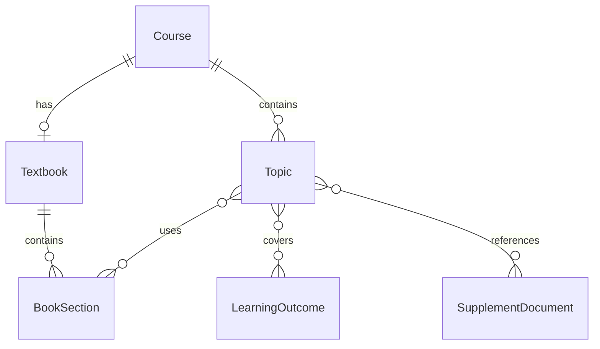
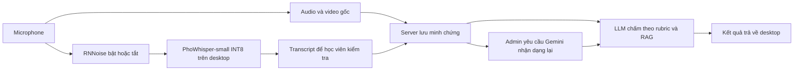

# Mở rộng giáo trình, chủ đề và STT — 11/09/2026

[README / danh mục tài liệu](../../README.md#hướng-dẫn-theo-nhu-cầu)

**Cập nhật 20/09/2026:** [Độ tin cậy và chấm lại theo phiên bản đề](grading-confidence.md) mô tả kiểm tra snapshot, confidence chưa có dữ liệu và luồng chấm transcript không gọi STT. Nhận dạng lại audio không tự khắc phục đề lệch provider/embedding.

## Mô hình kiến thức

Giữ một file PDF giáo trình ở cấp môn; không tạo bản sao vật lý cho từng chương. `Document.kind=TEXTBOOK` có unique index theo môn. Tài liệu bổ sung có `kind=SUPPLEMENT`. Giáo trình tối đa 100 MB, tài liệu bổ sung 20 MB; cấu hình bằng `MAX_TEXTBOOK_MB` và `MAX_DOCUMENT_MB`.

- `book_sections`: tên, cấp tiêu đề 1–6, trang đầu/cuối, nguồn BOOKMARK/HEADING/FALLBACK/MANUAL.
- Ưu tiên bookmark PDF. Nếu thiếu, nhận dạng dòng `Chương`, `Chapter`, `Phần`, `Part`, hoặc đánh số `1.1`… Nếu không xác định được thì gợi ý toàn sách để giảng viên tự chia.
- Số trang là thứ tự trong PDF từ 1. Có thể sửa/thêm/xóa mục; không xóa mục còn được chủ đề tham chiếu. PDF scan cần OCR trước; chưa có phân tích font/layout hay OCR tự động.
- Chunk theo trang và ranh giới header nhận dạng được, tối đa 2400 ký tự; lưu trang, heading, document ID và embedding. Tối đa 2000 chunks/file. Liên kết chương dựa trên **phạm vi trang**, nên các mục bắt đầu chung trang có thể dùng chung nội dung trang đó.
- `topic_outcomes`, `topic_sections`, `topic_documents` là các bảng liên kết nhiều–nhiều. Kiểm tra tất cả ID cùng môn trên server; các FK ngăn xóa đối tượng đang dùng.
- UI tạo/sửa chủ đề yêu cầu ít nhất một LO và một chương/mục. Giáo trình qua chương đã chọn là một nguồn tài liệu; có thể gắn thêm nhiều tài liệu bổ sung. API vẫn nhận `learning_outcome_id` đơn cho client/seed MVP cũ; nên chuyển sang mảng ID khi tích hợp mới.
- Mỗi bản công bố mới lưu `topic_chunk_ids`, các ánh xạ LO/chương/tài liệu và câu hỏi trong snapshot. Chấm thường/chấm lại dùng đúng tập chunk này. Chỉnh ánh xạ hoặc trang chương chỉ ảnh hưởng đề công bố sau. Đề MVP cũ dùng tập tài liệu snapshot và cột topic cũ để giữ phạm vi ban đầu.
- Giáo trình READY được giữ bất biến. Nếu upload lỗi, có thể thay PDF tại mục **Thay PDF bị lỗi**; version tăng và worker xử lý lại. Cơ chế nhiều phiên bản giáo trình đang sử dụng chưa triển khai.

## Pipeline giọng nói — cập nhật 17/09/2026

Desktop luôn dùng helper local, kể cả khi cấu hình STT cũ trên server là Google. Bộ cài chứa runtime, FFmpeg và model PhoWhisper-small; không tải model lúc thi, không cần Python trên máy học viên. RNNoise chạy trong AudioWorklet ở 48 kHz; helper chuyển âm thanh thành mono 16 kHz và nhận dạng với ngôn ngữ đã chọn. `STT_MODEL` chỉ điều khiển Whisper server, không thay model đóng gói trong desktop.

Media gốc và audio để nhận dạng là hai nhánh riêng. Bật/tắt RNNoise chỉ ảnh hưởng audio nhận dạng. Khi nộp, desktop upload audio/video gốc và transcript; worker chấm bất đồng bộ. Transcript nhập tay hoặc độ tin cậy thấp cần giảng viên kiểm tra. Lỗi AI, bài demo hoặc đang chờ chấm không được hiển thị thành điểm 0/10.

### Transcript và thuật ngữ

Chức năng sửa chính tả bằng LLM đã được gỡ. Người dùng có thể sửa transcript bằng tay; mọi bản sửa được đánh dấu để giảng viên đối chiếu với audio.

AI gợi ý thuật ngữ tiếng Anh và nghĩa tiếng Việt cùng lúc sinh câu hỏi, lưu trong snapshot đề và hiển thị ở workspace giảng viên. Không tự sửa transcript hoặc tự truyền gợi ý vào STT.

### LLM và cấu hình

`AI_CONFIG_SOURCE=env` là mặc định: `AI_PROVIDER`, `LLM_MODEL`, `EMBEDDING_MODEL`, `GEMINI_API_KEY` lấy từ môi trường API/worker, bỏ qua giá trị AI cũ trong `platform.json`. `AI_PROVIDER=local` dùng Ollama qua `LOCAL_LLM_URL`, JSON schema cho câu hỏi/chấm và embedding 768 chiều. `gemini` dùng Gemini API; `demo` chỉ thử quy trình, không tạo điểm chính thức. `AI_CONFIG_SOURCE=admin` giữ chế độ quản trị AI cũ trên web. Adapter thêm prefix truy vấn/tài liệu khi dùng `nomic-embed-text` theo [model card](https://huggingface.co/nomic-ai/nomic-embed-text-v1.5); cần đánh giá retrieval trên giáo trình tiếng Việt trước khi chọn model embedding triển khai.

Đổi AI provider/model cần xử lý lại tài liệu và công bố đề mới, vì snapshot đề và embedding có phiên bản. Gemini chỉ nhận dạng lại audio khi admin yêu cầu; bật Gemini LLM không bật Google STT.

### Nhận dạng lại có lịch sử — Gemini hoặc Google Cloud STT

Admin chọn nhà cung cấp cho mỗi lần review: `/gemini-review` dùng Gemini API key; `/google-review` dùng JSON service account. Cả hai endpoint chỉ ADMIN, yêu cầu lý do, câu đã chấm trong bài đã nộp và audio upload hoàn tất. Dùng `GEMINI_API_KEY` + `GEMINI_STT_MODEL`, không cần service-account JSON. Có thể dùng khi LLM chấm chạy Ollama.

Job lưu trong database, nhận dạng từ audio gốc đã kiểm tra checksum. WAV được chia đoạn 55 giây để gửi Gemini inline audio; giữ toàn bộ phần cuối. Không tự đổi provider khi lỗi. Worker dùng transcript mới và snapshot đề để chấm, lưu lịch sử trước/sau và audit; không ghi đè transcript đã nộp hoặc media gốc. Job lỗi giữ kết quả trước đó. Yêu cầu trùng khi đang chờ trả cùng ID.

Gemini không trả acoustic confidence tương đương Whisper: adapter đánh dấu `confidence_source=unavailable` và độ tin cậy STT bằng 0, vì vậy kết quả cần giảng viên kiểm tra, không tự công nhận điểm dựa trên một confidence giả.

### Trình duyệt và credentials

Cấu hình STT trên web chọn `local` (yêu cầu desktop), `local_server` (Whisper trong API), `gemini` hoặc `google`, cùng ngôn ngữ `vi`/`en`. Policy đã lưu ưu tiên hơn `STT_PROVIDER`; desktop chỉ dùng ngôn ngữ, luôn nhận dạng local. Audio nhận dạng tối đa 600 giây, request tối đa 30 MB. RNNoise không tách được chắc chắn người khác nói chồng.

Google Cloud STT là lựa chọn được hỗ trợ trên giao diện: admin upload JSON qua `/admin/settings/speech/google-credentials`. File riêng quyền 600, không trả private key hoặc chuyển xuống desktop; upload không đổi policy hoặc LLM. Thiếu key Gemini/JSON Google chỉ chặn provider tương ứng. Job đang chờ bằng provider khác trả 409 khi admin yêu cầu đổi provider; không tạo hai job song song hoặc âm thầm dùng nhầm provider.

Nguồn: [PhoWhisper](https://github.com/VinAIResearch/PhoWhisper), [RNNoise Web Audio](https://github.com/sapphi-red/web-noise-suppressor), [Ollama structured outputs](https://docs.ollama.com/capabilities/structured-outputs), [Gemini audio](https://ai.google.dev/gemini-api/docs/audio).
