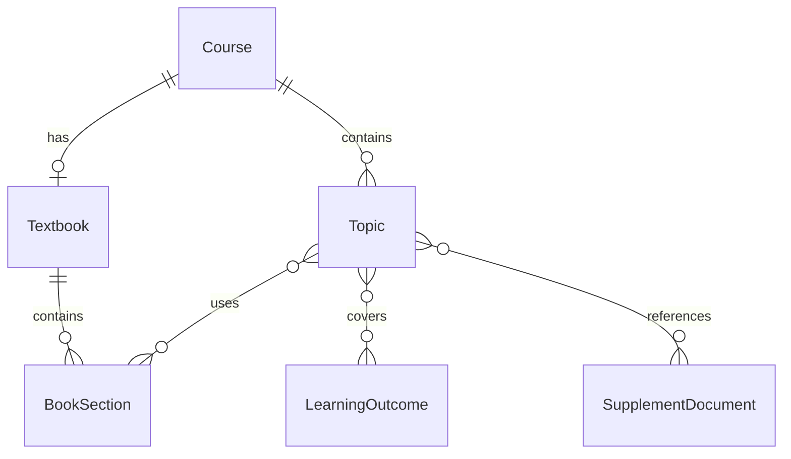
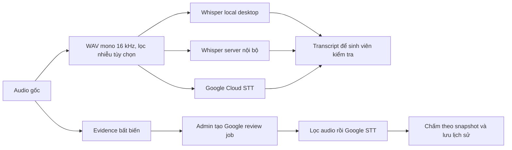

# Mở rộng giáo trình, chủ đề và STT — 11/09/2026

## Mô hình kiến thức

Giữ một file PDF giáo trình ở cấp môn; không tạo bản sao vật lý cho từng chương. `Document.kind=TEXTBOOK` có unique index theo môn. Tài liệu bổ sung có `kind=SUPPLEMENT`. Giáo trình tối đa 100 MB, tài liệu bổ sung 20 MB; cấu hình bằng `MAX_TEXTBOOK_MB` và `MAX_DOCUMENT_MB`.

- `book_sections`: tên, cấp tiêu đề 1–6, trang đầu/cuối, nguồn BOOKMARK/HEADING/FALLBACK/MANUAL.
- Ưu tiên bookmark PDF. Nếu thiếu, nhận dạng dòng `Chương`, `Chapter`, `Phần`, `Part`, hoặc đánh số `1.1`… Nếu không xác định được thì gợi ý toàn sách để giảng viên tự chia.
- Số trang là thứ tự trong PDF từ 1. Có thể sửa/thêm/xóa mục; không xóa mục còn được chủ đề tham chiếu. PDF scan cần OCR trước; chưa có phân tích font/layout hay OCR tự động.
- Chunk theo trang và ranh giới header nhận dạng được, tối đa 2400 ký tự; lưu trang, heading, document ID và embedding. Tối đa 2000 chunks/file. Liên kết chương dựa trên **phạm vi trang**, nên các mục bắt đầu chung trang có thể dùng chung nội dung trang đó.
- `topic_outcomes`, `topic_sections`, `topic_documents` là các bảng liên kết nhiều–nhiều. Kiểm tra tất cả ID cùng môn trên server; các FK ngăn xóa đối tượng đang dùng.
- UI tạo/sửa chủ đề yêu cầu ít nhất một LO và một chương/mục. Giáo trình qua chương đã chọn là một nguồn tài liệu; có thể gắn thêm nhiều tài liệu bổ sung. API vẫn nhận `learning_outcome_id` đơn cho client/seed MVP cũ; nên chuyển sang mảng ID khi tích hợp mới.
- Mỗi bản công bố mới lưu `topic_chunk_ids`, các ánh xạ LO/chương/tài liệu và câu hỏi trong snapshot. Chấm thường/chấm lại dùng đúng tập chunk này. Chỉnh ánh xạ hoặc trang chương chỉ ảnh hưởng đề công bố sau. Đề MVP cũ dùng tập tài liệu snapshot và cột topic cũ để giữ phạm vi ban đầu.
- Giáo trình READY được giữ bất biến. Nếu upload lỗi, có thể thay PDF tại mục **Thay PDF bị lỗi**; version tăng và worker xử lý lại. Cơ chế nhiều phiên bản giáo trình đang sử dụng chưa triển khai.

## Pipeline giọng nói

Admin lưu provider `local`, `local_server`, `google`, preprocessing `denoise`/`off`, language `vi`/`en` trong `system_settings`. Mặc định là server nội bộ + lọc nhiễu. Cả desktop/web lấy policy trước mỗi lần STT; local yêu cầu Electron. Server nội bộ chính là process API chạy Whisper trong hạ tầng của đơn vị, không phải một URL dịch vụ bên thứ ba tùy ý.

Module audio dùng chung cho server và subprocess desktop. FFmpeg lọc highpass 80 Hz, lowpass 7600 Hz, `afftdn` thích nghi, `loudnorm`; đầu ra PCM 16-bit mono 16 kHz. `off` vẫn đổi định dạng cho nhà cung cấp. Mỗi câu tối đa 600 giây, request STT tối đa 30 MB. Không sửa hoặc ghi đè bản evidence. Bộ lọc không tách riêng sinh viên khỏi người khác nói chồng và không thay thế mô hình source separation.

Google adapter dùng OAuth service-account credentials ở backend và REST `v1/speech:recognize`; chia PCM 55 giây/đoạn, không bỏ phần cuối. Không tự fallback nhà cung cấp khi lỗi. Không có credentials Google trong admin response hoặc IPC. STT và Gemini chấm là hai cấu hình độc lập; demo chấm vẫn có thể dùng Google STT khi admin chọn.

### Upload credentials từ admin

`POST /admin/settings/speech/google-credentials` nhận multipart `file` tối đa 64 KB, chỉ ADMIN. Kiểm tra JSON service account, project/email/key ID/private key, token URI cố định `https://oauth2.googleapis.com/token`, domain `googleapis.com` và parse khóa bằng Google auth. Không dùng URL do JSON tùy ý cung cấp để gửi private key/token. Lỗi trả thông báo chung không chứa nội dung file; upload không gọi Google hoặc đổi STT policy.

Khóa lưu riêng ở `DATA_DIR/secrets/google-stt.json` (600, thư mục 700), ghi file tạm và atomic replace. Không lưu private key trong database, audit, response hoặc endpoint download. Audit chỉ lưu người upload, project và email service account. Compose dùng volume `app_data` sẵn có cho API/worker cùng UID; mỗi lần STT đọc credentials hiện tại nên không phải restart. Triển khai nhiều host cần filesystem dùng chung và sao lưu volume chứa khóa.

File upload được ưu tiên trước file cấu hình bằng biến môi trường. File upload còn tồn tại nhưng lỗi/không đọc được không tự chuyển sang tài khoản cũ. Admin thấy `ready`, `missing`, `unreadable` hoặc `invalid`, nguồn upload/environment và metadata công khai khi file hợp lệ; `ready` chỉ xác nhận file/khóa đọc được, không xác nhận API/billing/quota. Không có migration mới cho chức năng này.

`review_jobs` là hàng đợi database bền vững. Chỉ ADMIN tạo job cho câu đã GRADED thuộc bài đã nộp, có AUDIO COMPLETED; bắt buộc lý do. Yêu cầu lặp khi job còn PENDING trả cùng ID. Worker kiểm tra checksum audio gốc, nhận dạng Google, chấm theo snapshot rồi lưu kết quả trước/sau và audit. Trong khi chờ, chưa công nhận điểm cuối. Lỗi giữ đánh giá trước và cho phép tạo lần thử mới; job đã hoàn thành/lỗi không bị ghi đè. Transcript sinh viên và payload idempotency không thay đổi. Worker crash rollback giao dịch, có thể gọi lại nhà cung cấp khi chạy tiếp.

UI xem bài hiển thị transcript sinh viên, transcript Google dùng cho đánh giá hiện tại, audio/video, điểm và lịch sử. Spinner STT/nộp câu trả lời dùng `role=status`; khóa textarea, ghi lại và thử STT trong lúc nộp.

## Nâng cấp

Migration `0002` bổ sung bảng/cột, chuyển LO và tài liệu đơn cũ sang các bảng liên kết. Không xóa dữ liệu cũ hoặc volume Docker. SQLite migration có kiểm tra foreign key sau dựng lại bảng; PostgreSQL dùng ALTER và transaction. Bản cập nhật này không hỗ trợ downgrade tự động vì cần bảo toàn lịch sử review và quan hệ mới; dùng backup nếu cần quay lại bản cũ.

## Tài liệu nhà cung cấp

- [Google STT authentication](https://docs.cloud.google.com/speech-to-text/docs/v1/authentication)
- [Google STT quotas and limits](https://docs.cloud.google.com/speech-to-text/docs/v1/quotas)
- [FFmpeg afftdn](https://ffmpeg.org/ffmpeg-filters.html#afftdn)
