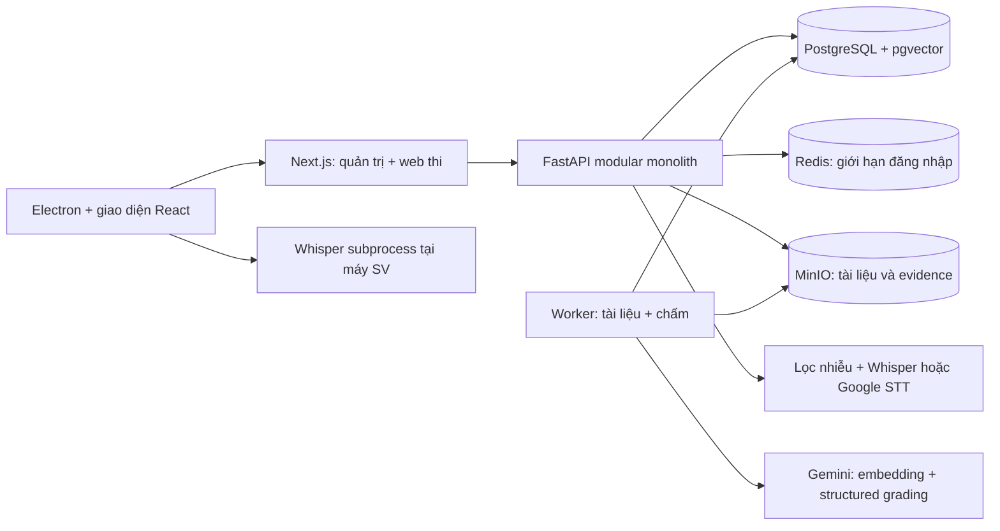

# Hướng triển khai giai đoạn 1 — MVP

[README / danh mục tài liệu](../../README.md#hướng-dẫn-theo-nhu-cầu)

Phạm vi theo mục 21 trong [tài liệu gốc](../../AI_Oral_Assessment_PROJECT_GUIDE.md): chứng minh luồng tài liệu → rubric → đề thi → trả lời bằng giọng nói → STT → RAG + chấm → lưu minh chứng → giảng viên xem lại. Đây là toàn bộ MVP, không chỉ Sprint 0/1.

**Cập nhật 11/09/2026:** giáo trình PDF cấp môn, chủ đề nhiều LO/chương/tài liệu, cấu hình STT và Google nhận dạng/chấm lại đã được bổ sung. Thiết kế chi tiết, migration và giới hạn tại [Mở rộng kiến thức và STT](knowledge-speech.md).

## Hướng đi

1. **Nền tảng:** monorepo, PostgreSQL/pgvector, MinIO, Redis, migration, JWT và phân quyền.
2. **Dữ liệu môn học:** môn học, LO, chủ đề; nhập PDF/PPTX/DOCX/TXT, tách văn bản theo trang/slide/nhóm đoạn, tạo embedding.
3. **Thiết kế đề:** rubric nhiều tiêu chí có trọng số, blueprint chủ đề/độ khó/số câu. Công bố đề tạo câu hỏi theo RAG và cố định các phiên bản.
4. **Thực hiện bài thi:** giao bài theo sinh viên, kiểm tra thiết bị, thu audio/video theo từng câu, lọc nhiễu và STT theo policy admin (local Electron / server nội bộ / Google), nộp transcript và tải minh chứng nền.
5. **Đánh giá:** worker truy xuất đúng môn/chủ đề/tập tài liệu đã công bố, kiểm tra JSON từ AI, tính điểm server và confidence gate.
6. **Đối chiếu:** giảng viên xem transcript, điểm tiêu chí, tài liệu RAG, audio/video; kết quả thiếu tin cậy giữ trạng thái cần xem lại.

## Kiến trúc đã triển khai

Worker là process riêng dùng chung code backend, không phải hệ microservice. Job nằm trong trạng thái bản ghi PostgreSQL; worker dùng `FOR UPDATE SKIP LOCKED`. Crash trước commit khiến transaction rollback, công việc được lấy lại. SQLite chỉ dành cho phát triển và một worker; không dùng SQLite cho triển khai nhiều người.

## Quyết định cụ thể

- **MVP mở rộng thêm web thi:** dùng chung giao diện Next.js cho web và Electron. Electron được phép đọc origin cấu hình và chỉ expose IPC STT; `contextIsolation=true`, `sandbox=true`, `nodeIntegration=false`.
- **STT:** mặc định Whisper server nội bộ. Admin chọn provider, lọc nhiễu, ngôn ngữ; Electron/web đều theo policy này. Chọn local yêu cầu desktop. Confidence Whisper là heuristic trung bình likelihood, chưa được hiệu chuẩn; transcript sửa tay có confidence 0 và cần xem lại.
- **Demo không phải chấm AI:** demo dùng hashing vector 768 chiều để thử luồng, câu hỏi theo mẫu và không tạo điểm. Gemini dùng embedding thật, sinh câu hỏi và chấm structured JSON. Không tự chuyển sang demo khi Gemini lỗi.
- **Snapshot ngay từ MVP:** tuy checklist Pilot nhắc versioning, nguyên tắc kiến trúc bắt buộc khả năng truy vết; đề đã công bố không sửa/xóa. Snapshot chứa rubric, câu hỏi, tập document ID bất biến, model, provider, embedding và prompt version. Thay cấu hình AI sau publish khiến các bài cũ cần xem lại, không âm thầm chấm bằng phiên bản mới.
- **Chunk upload ngay từ MVP:** tuân thủ quy tắc không upload media lớn trong một request. Hash từng chunk và cả file, retry ngắn; hàng đợi ở bộ nhớ client. Chưa có lưu hàng đợi bền vững hay resume sau crash.
- **Điểm:** chuẩn hóa mỗi tiêu chí `score / max_score`, nhân trọng số, chia tổng trọng số, quy về 10. Điểm bài là trung bình điểm các câu. Chỉ công nhận nếu mọi câu hợp lệ và không cần review. LO weight là metadata; blueprint quyết định phân bổ số câu, không tự nhân LO weight lần nữa.
- **Hết giờ:** server chặn bắt đầu câu mới. Transcript của câu đã bắt đầu vẫn được tiếp nhận khi đến trễ, có đánh dấu cần xem lại. Câu còn trống được ghi nhận thiếu bài và cần review khi nộp.
- **Tài liệu:** lưu theo phiên bản bất biến (mỗi lần upload là một document mới, version 1). DOCX gộp nội dung và bảng với page=1 vì không có phân trang xác định; PDF scan phải OCR trước. Không xóa tài liệu đã nằm trong snapshot.
- **Quyền:** ADMIN quản lý toàn bộ; TEACHER quản lý môn do mình tạo; REVIEWER xem tất cả môn/kết quả và không thay đổi; STUDENT chỉ thấy bài được giao và dữ liệu của chính mình.

## Giới hạn MVP và bước tiếp

Chưa triển khai local SQLite mã hóa, offline exam, khôi phục sau crash, upload queue bền vững, sửa điểm thủ công, ghép video toàn bài, OCR, chống gian lận nâng cao, giám sát production và SSO. Google nhận dạng/chấm lại có lịch sử đã được bổ sung; các phần còn lại thuộc Pilot/Production theo tài liệu gốc.

Trước Pilot cần chạy đánh giá với Gemini thật và giọng nói tiếng Việt thực tế, bộ 100 bài synthetic, đối chiếu điểm giảng viên, kiểm thử mạng lỗi/khôi phục, tải đồng thời và chính sách lưu dữ liệu. Không coi test mô phỏng hoặc demo là chứng nhận chất lượng AI.

## Tài liệu API nhà cung cấp đã tham khảo

- [Gemini structured output](https://ai.google.dev/gemini-api/docs/generate-content/structured-output)
- [Gemini embeddings](https://ai.google.dev/gemini-api/docs/embeddings)
- [Next.js rewrites](https://nextjs.org/docs/app/api-reference/config/next-config-js/rewrites)
